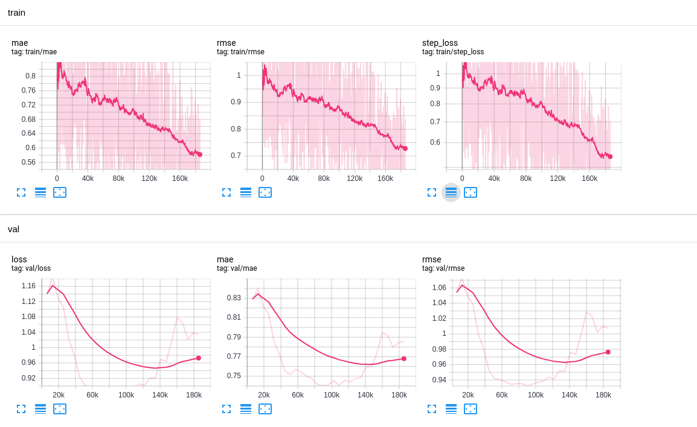

# Behavior-Sequence-Transformer-Pytorch

This is a pytorch implementation for the BST model from Alibaba https://arxiv.org/pdf/1905.06874.pdf

This model is a novel recommender architecture based on seq2seq models. We translate user behaviour into sequences and predict a rating for each target item (movie).
# Dataset
For this implementation we used Movielens [1M Dataset](https://movielens.org/) that contains timestamps per each rating, making it perfect to test in the sequence recommendation model.

# Running

You can run it in colab [here](https://colab.research.google.com/github/jiwidi/Behavior-Sequence-Transformer-Pytorch/blob/master/colab-bst.ipynb). If you prefer to run locally the model architecture is contained on `pytorch-best.ipynb` while data processing is on the `prepare_data.ipynb` notebook and should be run first.

# Results
Training on all-1 user ratings and leaving the latest rating for test we obtain the following results

| Dataset |  MAE  | RMSE |
| :------ | :---: | ---: |
| Train   | 0.72  | 0.84 |
| Test    | 0.74  | 0.93 |

Here is a screenshot of training logs we we see overfitting from epoch 12-15.

# References

* Original paper [1](https://arxiv.org/pdf/1905.06874.pdf)
* Keras implementation [2](https://keras.io/examples/structured_data/movielens_recommendations_transformers/)
* Tensorflow implementation [3](https://github.com/shenweichen/DeepCTR/blob/master/deepctr/models/bst.py)
